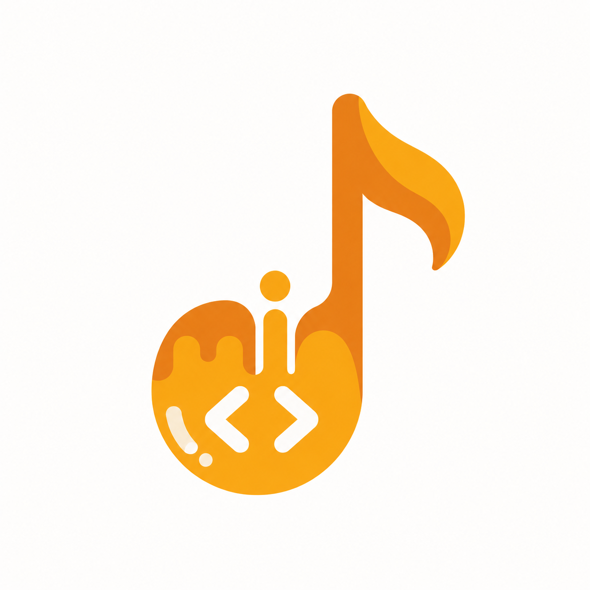

<p align="center">
  
</p>

# miod

> [!IMPORTANT]
> Only tested on macOS. Not sure yet how it behaves on Linux or Windows.

I'm an engineer, but these days I solve the boring problems entirely by vibe coding. Somewhere along the way I felt I had lost the creativity and curiosity I used to have when writing code myself.

So I started thinking about how to make vibe coding fun again. miod is the first try: while the agent does the work, you get to hear it think, read, edit, fail and fix, with a little piece of music no one has heard before.

Feel free to add more moods, flavours and styles. Each mood is one row in `hooks/moods.ts`, each flavour one row in `hooks/flavours.ts`, and each sound style one entry in `hooks/styles.ts`.

Feeling it's a bit too noisy? 🙉 No hard feelings. Just [turn it off](#usage) with `/miod off`.

## What it is

A Claude Code mod (MIDI + mod) that writes music on the spot while Claude works. No music files, no library, no AI model.

- Every task picks its own flavour (lo-fi, chiptune, ambient, jazzy and 8 more), key, scale (16 of them), chord progression, tempo, sound and theme.
- The mood follows what the agent is doing, bent by the task's flavour, so editing in a lo-fi task sounds nothing like editing in a chiptune one.
- The faster it spends tokens, the busier the music.
- A wave above the prompt moves with each phrase, coloured by mood.
- Tasks flow into each other: the next task fades in, in a related key. If no new task comes, a closing chord fades out at the end of the phrase.

## Install

Needs Claude Code 2.1.290 or newer, on macOS.

```bash
claude plugin marketplace add delexw/miod
claude plugin install miod@miod
```

Then start a new session.

## Usage

```
/miod        is it on or off?
/miod off    stop the music
/miod on     play again from the next task
```

## How the mood is picked

| The agent is… | When it uses… | Sounds |
| --- | --- | --- |
| thinking | no tool | calm |
| reading | Read, Grep, Glob, MCP tools | airy |
| exploring | WebSearch, WebFetch | curious (lydian) |
| planning | TodoWrite, plan mode | hopeful (major pentatonic) |
| asking | AskUserQuestion | waiting, almost silent |
| editing | Edit, Write | bright (major) |
| running | Bash | driving beat |
| installing | npm, bun, pip, brew… install | patient (minor pentatonic) |
| testing | test, check, lint, tsc | focused (dorian), busy beat |
| shipping | git commit, push, merge, gh pr | triumphant (mixolydian) |
| deleting | rm -r, git reset --hard, git clean | ominous (phrygian), low drone |
| delegating | Agent | one harmony voice per subagent |
| failing | a Bash command that failed | tense (minor), until a command passes |

When several happen in one 8-beat phrase, the one higher in `STRONGEST_FIRST` (`hooks/activity.ts`) wins. A filling context window lifts the melody and, past 80%, adds a low drone.

The scales follow how musicians describe each mode ([musical-u](https://www.musical-u.com/learn/the-many-moods-of-musical-modes/), [Jiang et al. 2024](https://www.frontiersin.org/journals/psychology/articles/10.3389/fpsyg.2024.1414014/full)).

## Add a mood or style

- **Mood:** add the name to `Activity` and `STRONGEST_FIRST` in `hooks/activity.ts`, map tools or commands to it there, and give it a row in `MOODS` in `hooks/moods.ts`.
- **Flavour:** add a row to `FLAVOURS` in `hooks/flavours.ts`. Each field nudges every mood: brighter or darker scale, busier or calmer, drums up or down, swing, bass line.
- **Scale or chords:** add to `SCALES` or `PROGRESSIONS` in `hooks/theory.ts`.
- **Style:** add a wave function to `STYLES` in `hooks/styles.ts`. It must return values between -1 and 1.

Then check it:

```sh
claude plugin validate .
claude plugin test .
```

Run a checkout without installing it with `claude --plugin-dir <path to this repo>`.

## Limitations

- Only tested on macOS, where Claude Code plays the audio through `afplay`.
- The sound is simple chiptune-style tones.
- miod only hears the session it's loaded in.
